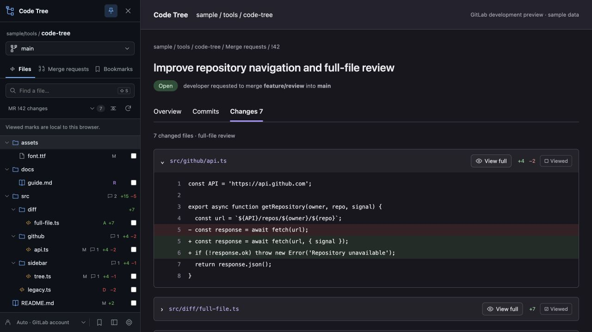
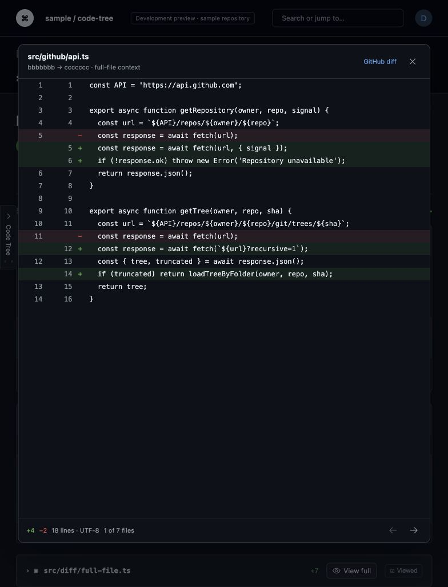

# Code Tree

A browser extension for exploring and reviewing **GitHub and GitLab** repositories from a code tree.

**Version 0.2.0 · Chrome / Chromium 114+ · Manifest V3**

Browse files, switch branches, review PR/MR changes and open the whole changed file without leaving the request. Code Tree runs locally and talks directly to your repository host. No Code Tree account, subscription or backend is required.

## Preview





These screenshots show a local development fixture with sample data and the actual extension scripts. They do not show an installed extension on a live repository.

## Description

- Repository file tree with file/folder search, keyboard navigation and branch switching.
- Changed-file tree for PRs, MRs and commits, with additions/deletions aggregated by folder.
- Inline review comments with authors and links to their discussions.
- **View full** in native file headers: complete UTF-8 text, highlighted changes and both revision line numbers. Works with a closed sidebar, collapsed files, additions, deletions and unchanged renames.
- Open PR/MR lists with **Requested from me**, **Reviewed by me**, **Changes requested**, **Approved** and **No reviews** filters.
- Viewed marks, unlimited local bookmarks, three original icon styles and configurable code fonts/sizes.
- Left/right docking, pinning, hover opening and resizing.
- Multiple accounts, GitHub Enterprise Server and self-managed GitLab over HTTPS.

See [Features](docs/FEATURES.md) for provider differences. This is an independent implementation with original code, interface and icons.

## Quick start

1. Clone or download this repository and extract it if necessary.
2. Open `chrome://extensions` and enable **Developer mode**.
3. Select **Load unpacked** and choose the directory containing `manifest.json`.
4. Open or refresh a GitHub or GitLab repository page.

```sh
git clone https://github.com/ziqq/Codetree.git
```

No dependency installation or build step is needed. After updating, click **Reload** on the extension card and refresh repository tabs. After disabling the extension, refresh tabs to remove the previously injected UI.

## Getting started

The edge tab opens the sidebar. Use **Files**, **Pull requests / Merge requests** and **Bookmarks** to switch sections. PR/MR and commit pages initially show changed files; the selector above the tree also provides the repository tree.

Click a changed file to jump to its native diff. Use **View full** in its page header or the tree's full-diff action to see the whole file. Previous/next controls navigate all changed files, independently of sidebar search.

| Shortcut | Action |
| --- | --- |
| `Shift+D` | Open or close the sidebar |
| `Shift+S` | Open the sidebar and focus search |
| Arrow keys | Navigate and expand/collapse rows |
| `Enter` | Open a file or toggle a folder |

Shortcuts do not run while editing an input or contenteditable element.

### Accounts

Public repositories work without a token. Open **Settings** to connect an account for private repositories, review filters and authenticated API limits.

| Provider | Permissions | Server API |
| --- | --- | --- |
| GitHub | Fine-grained PAT: selected repositories, **Contents: read**, **Pull requests: read**. Classic PAT: `repo` for private repositories. Organization approval/SSO may apply. | `https://api.github.com` |
| GitHub Enterprise Server | Token issued by that server with the corresponding repository access. | Website origin + `/api/v3`; GraphQL + `/api/graphql` |
| GitLab | Personal access token with **`read_api`** and project access. Discussions and review filters may require authentication even on public projects. | Website origin + `/api/v4` |

GitHub's Viewed mutation may need additional permission. A failed write reports an error and restores the previous checkbox state. GitLab Viewed marks are local and do not change native GitLab review state.

Choose the provider and its HTTPS website origin in Settings. For a custom server, Chrome requests access to that host during connection. Refresh existing server tabs afterward. Installations under a URL subpath are not supported.

Tokens are verified directly through the chosen host's `/user` endpoint. Connecting the same host/username replaces its token. **Auto** uses a matching page username when available, or the host's only account. With multiple accounts and no detected username, select an account in the footer.

### Large repositories

The tree renders visible rows with a small buffer. GitHub normally loads a recursive tree and falls back to loading folders when its API truncates the response. GitLab loads one folder at a time, including projects in nested namespaces.

Search covers loaded files until **Load all folders for search** finishes; the sidebar identifies this scope. API requests are deduplicated and cached in bounded service-worker memory. The cache is not persistent.

## Privacy

Preferences, accounts, tokens, bookmarks and local Viewed marks live in `chrome.storage.local` for the browser profile. Token storage is restricted to trusted extension contexts. Page/content scripts receive no tokens.

Requests go directly to the selected repository API. Tokens stay bound to its API host; redirects and cookie credentials are disabled. There is no analytics, external font download or third-party runtime dependency. See [Privacy](PRIVACY.md).

## Limitations

- This delivery targets Chrome/Chromium as an unpacked extension. Firefox, Safari and store distribution have not been validated.
- GitHub's PR-files API returns at most 3,000 changed files. GitLab has server diff limits and may omit patches. Incomplete data is identified explicitly.
- Paginated lists fail explicitly beyond 10,000 results.
- Full-file previews support UTF-8 text up to **2 MiB per revision** and **100,000 combined lines**. Binary files, other encodings and incomplete patches show an unavailable-preview state with a native diff link. Syntax highlighting is not implemented.
- PR/MR comparisons use the merge base and request head; commit comparisons use the first parent. Private fork requests need access to both source repositories.
- GitLab review filters depend on supported reviewer/approvals endpoints, server states and token access. Unsupported endpoints report errors. Viewed is local on GitLab and falls back to local mode on GitHub when GraphQL is unavailable.
- Native header integration depends on the provider's page structure. Layout changes may need an adapter update; the sidebar full-file action is also available.
- PAT authentication is supported. OAuth, cloud sync, custom shortcuts and per-window pinning are not implemented. Branch switching opens the branch root.

## Project structure

```text
manifest.json      Chrome MV3 entry points and permissions
core.js            Routes, URLs, tree logic, icons and patch validation
background.js      API broker, storage, GitHub adapter and bounded cache
gitlab.js          GitLab repository, MR, commit and review adapter
content.js         Sidebar, native View full buttons and full-file viewer
sidebar.css        Isolated sidebar/viewer styles
options.*          Settings and account management
icons/             Original extension icons
docs/              Feature details and verification record
```

## Development

Use the repository root as an unpacked extension. JavaScript uses two-space indentation, single quotes and explicit DOM construction.

```sh
for file in core.js background.js gitlab.js content.js options.js; do
  node --check "$file" || exit 1
done
```

Syntax checks do not exercise Chrome's extension environment. Read [Contributing](CONTRIBUTING.md), [Verification](docs/VERIFICATION.md), [Changelog](CHANGELOG.md) and [AGENTS.md](AGENTS.md).

## License

The maintainer is selecting terms that restrict commercial use. Publishing this repository grants no commercial license. The final license will be recorded here and in `LICENSE` before the licensed release is published.
