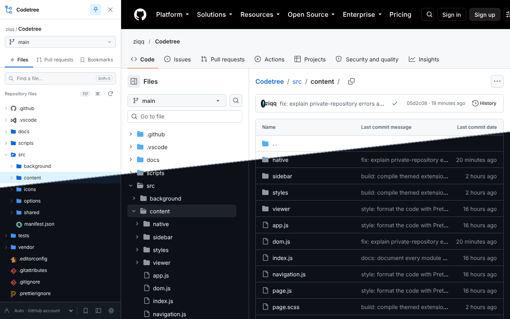
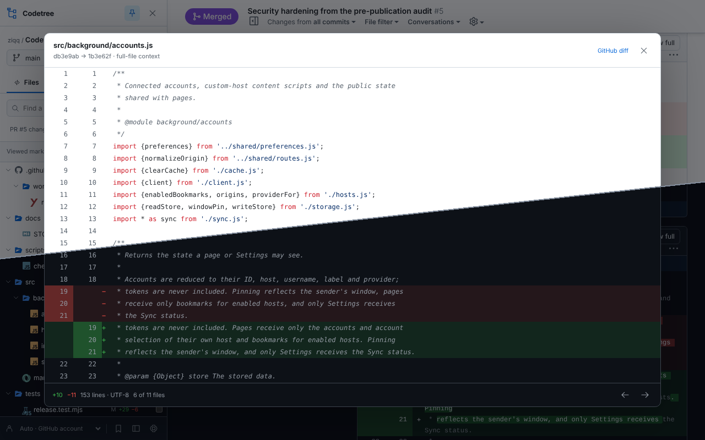
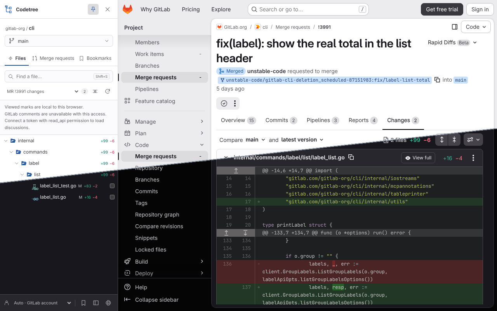

# Codetree

A browser extension for exploring and reviewing **GitHub and GitLab** repositories from a code tree.

**Version 0.3.1 · Chrome / Chromium 116+ · Manifest V3**

Browse files, switch branches, review PR/MR changes and open the whole changed file without leaving the request. Codetree runs locally and talks directly to your repository host. No Codetree account, subscription or backend is required.

## Preview







These screenshots show Codetree 0.3.1 installed from a local build on public pages (the Codetree repository on GitHub and `gitlab-org/cli` on GitLab) without an account. Each image joins identical light and dark captures: light above the seam, dark below. Separate light and dark captures are in `docs/store/screenshots/`.

## Description

- Repository file tree with file/folder search, keyboard navigation and branch switching.
- Changed-file tree for PRs, MRs and commits, with additions/deletions aggregated by folder.
- Inline review comments with authors and links to their discussions.
- **View full** in native file headers: complete UTF-8 text, highlighted changes and both revision line numbers. Works with a closed sidebar, collapsed files, additions, deletions and unchanged renames.
- Open PR/MR lists with **Requested from me**, **Reviewed by me**, **Changes requested**, **Approved** and **No reviews** filters.
- Viewed marks, unlimited local bookmarks, [file-icons](https://github.com/file-icons/atom) file and folder icons (Color, Monochrome or Minimal) and configurable code fonts/sizes.
- Left/right docking, pinning per browser window, hover opening and resizing.
- Custom shortcuts, page-display rules, URL exclusions and folder-click preferences.
- Multiple accounts, GitHub Enterprise Server and self-managed GitLab over HTTPS.

See [Features](docs/FEATURES.md) for provider differences. This is an independent implementation with original code and interface. File and folder icons come from file-icons/atom; see [Third-party notices](THIRD_PARTY_NOTICES.md).

## Quick start

1. Download `codetree-<version>.zip` from [GitHub Releases](https://github.com/ziqq/Codetree/releases) and extract it into a folder.
2. Open `chrome://extensions` and enable **Developer mode**.
3. Select **Load unpacked** and choose the extracted folder containing `manifest.json`.
4. Open or refresh a GitHub or GitLab repository page.

To run the current source instead, bundle it first and load the generated `build/` folder:

```sh
git clone https://github.com/ziqq/Codetree.git
cd Codetree
npm ci
npm run build
```

After updating, click **Reload** on the extension card and refresh repository tabs. After disabling the extension, refresh tabs to remove the previously injected UI.

## Getting started

The edge tab opens the sidebar. Use **Files**, **Pull requests / Merge requests** and **Bookmarks** to switch sections. PR/MR and commit pages initially show changed files; the selector above the tree also provides the repository tree.

Click a changed file to jump to its native diff. Use **View full** in its page header or the tree's full-diff action to see the whole file. Previous/next controls navigate all changed files, independently of sidebar search.

| Shortcut | Action |
| --- | --- |
| `Shift+D` | Open or close the sidebar |
| `Shift+S` | Open the sidebar and focus search |
| Arrow keys | Navigate and expand/collapse rows |
| `Enter` | Open a file or toggle a folder |

These are the defaults; change toggle/search bindings in **Settings → Navigation**, or leave a binding blank to disable it. Shortcuts do not run while editing an input or contenteditable element.

### Accounts

Public repositories work without a token. Open **Settings** to connect an account for private repositories, review filters and authenticated API limits. Being signed in on the website does not authenticate the extension's API requests. A native **View full** button remains visible when API access is unavailable and offers account connection/retry guidance.

GitHub device-flow and GitLab PKCE sign-in are implemented without a backend or client secret. This build leaves their public client IDs empty, so OAuth buttons remain disabled until the maintainer supplies registered IDs. PAT connections remain available. See [OAuth setup](docs/OAUTH.md).

| Provider | Permissions | Server API |
| --- | --- | --- |
| GitHub | Fine-grained PAT: selected repositories, **Contents: read**, **Pull requests: read**. Classic PAT: `repo` for private repositories. Organization approval/SSO may apply. | `https://api.github.com` |
| GitHub Enterprise Server | Token issued by that server with the corresponding repository access. | Website origin + `/api/v3`; GraphQL + `/api/graphql` |
| GitLab | Personal access token with **`read_api`** and project access. Discussions and review filters may require authentication even on public projects. | Website origin + `/api/v4` |

GitHub's Viewed mutation may need additional permission. A failed write reports an error and restores the previous checkbox state. GitLab Viewed marks are local and do not change native GitLab review state.

Choose the provider and its HTTPS website origin in Settings. For a custom server, Chrome requests access to that host during connection. Refresh existing server tabs afterward. Installations under a URL subpath are not supported.

Tokens are verified directly through the chosen host's `/user` endpoint. Connecting the same host/username replaces its token. **Auto** uses a matching page username when available, or the host's only account. With multiple accounts and no detected username, select an account in the footer.

### Browser Sync

Enable **Settings → Browser Sync** to synchronize preferences and bookmarks through the browser’s account storage. It is off by default. Credentials, connected accounts, selected account IDs, Viewed marks, repository trees and file contents stay local.

Enabling applies existing remote preferences and merges bookmarks by URL; local bookmark details win for duplicate URLs. Later snapshots use the newest saved timestamp; equal timestamps use the last delivered snapshot. Device clock differences can delay incoming changes until a new local save. Sync has a conservative 8 KiB snapshot limit; quota failures leave local data saved and appear in Settings. Disabling stops this device without deleting local data or the shared copy.

Devices need the same browser ecosystem and extension ID. Chrome and Edge/Firefox/Safari account services do not form a shared account. Unpacked installations may have different extension IDs on different computers; do not treat them as a proven multi-device setup. Firefox/Safari builds and portable file transfer remain outside this delivery.

### Large repositories

The tree renders visible rows with a small buffer. GitHub normally loads a recursive tree and falls back to loading folders when its API truncates the response. GitLab loads one folder at a time, including projects in nested namespaces.

Search covers loaded files until **Load all folders for search** finishes; the sidebar identifies this scope. API requests are deduplicated and cached in bounded service-worker memory. Revision-keyed tree data also persists locally across worker/browser restarts, within 48 entries and a 4 MiB budget. Cached trees expire after 24 hours; expired entries are discarded on the next cache load/write. Cache keys include the host, repository, revision and API account; Refresh and account changes clear it. File text and review comments are not persisted in this cache.

## Privacy

Preferences, accounts, tokens, bookmarks, local Viewed marks and the tree cache live in `chrome.storage.local` for the browser profile. Pinning per window and pending device sign-in use trusted session storage. Token storage is restricted to trusted extension contexts. Page/content scripts receive no tokens. Browser Sync sends only preferences/bookmark metadata after explicit opt-in; bookmark URLs/titles can contain private repository names.

Requests go directly to the selected repository API. Tokens stay bound to its API host; redirects and cookie credentials are disabled. There is no analytics, external font download or third-party runtime dependency. See [Privacy](PRIVACY.md).

## Limitations

- This delivery targets Chrome/Chromium as an unpacked extension. Firefox, Safari and store distribution have not been validated.
- GitHub's PR-files API returns at most 3,000 changed files. GitLab has server diff limits and may omit patches. Incomplete data is identified explicitly.
- Paginated lists fail explicitly beyond 10,000 results, unexpected page sizes or a conservative 32 MiB aggregate budget. API JSON bodies are limited to 32 MiB, OAuth/error bodies to 64 KiB.
- Full-file previews support UTF-8 text up to **2 MiB per revision** and **100,000 combined lines**. Binary files, other encodings and incomplete patches show an unavailable-preview state with a native diff link. An original lexical highlighter covers common source/config languages; it is not a full grammar parser. Unknown languages and files exceeding its token budget retain complete plain-text diffs.
- PR/MR comparisons use the merge base and request head; commit comparisons use the first parent. Private fork requests need access to both source repositories.
- GitLab review filters depend on supported reviewer/approvals endpoints, server states and token access. Unsupported endpoints report errors. Viewed is local on GitLab and falls back to local mode on GitHub when GraphQL is unavailable.
- Native header integration depends on the provider's page structure. Layout changes may need an adapter update; the sidebar full-file action is also available.
- OAuth requires registered public client IDs and live verification before it is ready to use. Custom servers use PATs. Browser Sync is optional and remains within the browser ecosystem; cross-browser account sync is not implemented. Browser-reserved shortcuts may take priority. Branch switching opens the branch root.

## Project structure

```text
src/
  manifest.json          Chrome MV3 entry points and permissions
  shared/                Preferences, routes/URLs, tree model, diff validation and icons
  background/            Service worker: message broker, storage, cache, API client, accounts
    providers/           GitHub REST/GraphQL and GitLab REST adapters
    oauth/               Public client configuration and trusted OAuth flows
    sync.js              Opt-in browser Sync for preferences and bookmarks
  content/               Content script: Shadow DOM sidebar
    sidebar/             View, layout, file tree, branches, requests, bookmarks
    viewer/              Full-file diff viewer and lexical syntax highlighting
    native/              View full buttons in native diff headers
  options/               Settings and account management
  icons/                 Original extension icons
vendor/file-icons/       Vendored file-icons/atom rules, styles and fonts
scripts/                 Bundling, validation and deterministic packaging
tests/                   Node.js regression suite
docs/                    Feature details, releases and verification record
```

Sass compiles the sidebar, native controls and Settings SCSS; esbuild bundles each entry point (`background`, `content`, `options`) into one classic script in `build/`, which is the unpacked extension and the source of the release ZIP. See [Architecture](docs/ARCHITECTURE.md) for contexts, messages, storage and the build.

## Development

Edit styles in `src/content/sidebar.scss`, `src/content/styles/_themes.scss`, `src/content/page.scss` and `src/options/options.scss`. `npm run build` compiles them with Sass; `npm run lint:css` validates the compiled CSS. The sidebar and full-file viewer follow GitHub/GitLab light or dark themes, including live theme changes. Settings follows the browser/system preference. Sass is a build dependency and is excluded from the extension.

Edit `src/`, run `npm run build` and load `build/` as an unpacked extension. JavaScript uses ES modules and explicit DOM construction; run `npm run format` (Prettier) before committing. Node.js/npm provide bundling and checks only; the extension has no runtime dependencies. Python 3 creates the distributable ZIP. `make help` lists the same commands.

```sh
npm ci
npm run verify
```

CI checks JavaScript/CSS, manifest/CSP/assets, documentation, workflow syntax, locked dependencies and reproducible packaging on push/PR. Stable tags `vX.Y.Z` or a manual release run repeat the same checks before publishing a GitHub Release containing the runtime ZIP and SHA-256, then submit the ZIP to the Chrome Web Store when configured. Tags must match the manifest/changelog version and publication requires an approved license. See [Checks and releases](docs/RELEASING.md).

Automated checks do not exercise Chrome's installed extension environment. Read [Contributing](CONTRIBUTING.md), [Verification](docs/VERIFICATION.md), [Changelog](CHANGELOG.md) and [AGENTS.md](AGENTS.md).

## License

Codetree uses the **Codetree Source-Available License 1.0**. Read the full [LICENSE](LICENSE); it controls over this summary. This is a custom source-available license with commercial restrictions, not an OSI open-source license.

- Free personal and workplace use is allowed, including private repositories and commercial development projects.
- Internal modifications, free forks and pull requests are allowed under the license. Using the tool does not apply its license to your independent projects.
- Monetization of Codetree or covered derivatives is prohibited: sales, subscriptions, paid features, advertising, affiliate revenue, sponsorship, fork-related donations and commercial hosting/support/customization for third parties.
- Renaming a fork, adding features or incorporating covered material into a larger paid product does not remove the restrictions. There is no automatic conversion to a permissive license.
- Salary for ordinary development work and internal deployment/modification for the organization using the tool are allowed. Preserve the license and required notices when sharing covered material.

Separate written permission from the relevant rights holder is required for activities outside these terms. Third-party components retain their own licenses; see [Third-party notices](THIRD_PARTY_NOTICES.md).
