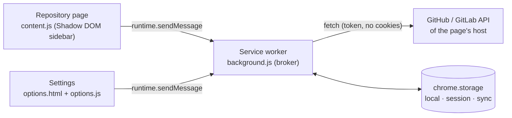

# Architecture

Codetree is a Manifest V3 extension with three execution contexts. Each has one entry point in `src/`, bundled by esbuild into one classic script in `build/`.

| Context | Entry | Responsibility |
| --- | --- | --- |
| Service worker | `src/background/index.js` | Trusted broker: accounts and tokens, API requests, caches, Viewed marks, bookmarks, preferences, Sync, OAuth. |
| Content script | `src/content/index.js` | Sidebar, full-file viewer and View full buttons on GitHub/GitLab pages. Holds no tokens. |
| Settings | `src/options/index.js` | Appearance, navigation, Sync and account management. Requests optional permissions. |

`src/shared/` contains side-effect-free modules used by all three: preferences and shortcuts, routes and URLs, the tree model, full-file diff validation and the original icons.

## Messages

Pages and Settings send `{type, context?, …}` to the worker and receive `{ok: true, value}` or `{ok: false, error}`. The broker checks every message against its sender before doing anything:

| Type | Sender | Purpose |
| --- | --- | --- |
| `STATE` | page, Settings | Public state: preferences, accounts without tokens, hosts, account selections, bookmarks; Sync status for Settings. |
| `PREFERENCES` | page, Settings | Save preferences. Pages may not change the default pin state. |
| `WINDOW_PIN` | page | Pin the sidebar in the sender's window and notify that window's tabs. |
| `BOOKMARK` | page | Add or remove a bookmark on an enabled host. |
| `SELECT_ACCOUNT` | page (own host), Settings | Choose the account for a host, or `auto`. |
| `OPTIONS` | page, Settings | Open Settings. |
| `ADD_ACCOUNT`, `REMOVE_ACCOUNT` | Settings | Connect a PAT after verifying it, or remove an account. |
| `SYNC_SETTINGS` | Settings | Enable, disable or re-run browser Sync. |
| `OAUTH_*` | Settings | OAuth availability, GitHub device flow, GitLab PKCE sign-in. |
| `INIT`, `TREE`, `BRANCHES`, `PULLS`, `DIFF`, `FILE`, `VIEWED`, `REFRESH` | page (own host) | Repository data for the page's validated context. |

Repository requests are dispatched to `providers/github.js` or `providers/gitlab.js` by the configured provider of the host. A page can only request data from its own origin, and only from enabled hosts.

## Service worker

| Module | Role |
| --- | --- |
| `index.js` | Message router, sender checks, error redaction, lifecycle listeners. |
| `storage.js` | Trusted local storage (`TRUSTED_CONTEXTS`), serialized writes, window pins (session storage), local Viewed marks. |
| `cache.js` | Memory cache (80 entries / 12 MiB) with request deduplication; persisted tree cache (48 entries / 4 MiB / 24 h). Clears use generations so stale replies are never cached. |
| `http.js` | Streaming body limits and list budgets (10,000 items / 32 MiB). |
| `client.js` | Host-bound API client: token header, `credentials: 'omit'`, `redirect: 'error'`, 25 s timeout, pagination, GraphQL, OAuth refresh. |
| `hosts.js`, `validate.js` | Enabled hosts, context validation, account selection, identifier validation. |
| `accounts.js` | Public state, account verification and removal, content scripts for custom hosts. |
| `sync.js` | Opt-in Sync snapshot of whitelisted preferences and bookmarks. |
| `oauth/` | Public client IDs and the device/PKCE/refresh flows. |
| `providers/` | GitHub REST/GraphQL and GitLab REST adapters. |

### Stored data

| Area | Key | Contents |
| --- | --- | --- |
| local | `preferences`, `accounts`, `selectedAccounts`, `bookmarks`, `localViewed` | Read through `readStore`; written through `writeStore`. Accounts include tokens. |
| local | `treeCache` | Persisted trees by account, host, repository and revision. |
| local | `syncSettings` | This device's Sync state. |
| session | `windowPins`, `oauthDevice` | Pin state per window; pending GitHub device authorization. |
| sync | `codetreeSyncSnapshot` | Only when Sync is enabled: preferences and bookmark URLs/titles/dates. |

## Content script

`app.js` composes the sidebar from feature factories. Each factory `createX(app)` receives the shared `app` object and returns its functions, which are merged into `app`; features call each other through `app` only at run time.

| Module | Role |
| --- | --- |
| `state.js` | State with signal-backed view fields, the derived visible rows (`flat`) and request generations (`epoch`, `filesGeneration`, `viewGeneration`, `refreshGeneration`, `branchGeneration`). |
| `page.js`, `dom.js` | Page context, theme and wording; DOM helpers using `textContent` only. |
| `navigation.js` | Page loads, header, tabs, Refresh. |
| `sidebar/view.js`, `layout.js`, `render.js` | Shadow DOM elements, placement and page padding, tab rendering. |
| `sidebar/files.js`, `tree.js` | Tree loading and lazy folders; virtualized rows, keyboard navigation, Viewed marks. |
| `sidebar/file-icons.js` | file-icons rule matching and glyph rendering. |
| `sidebar/branches.js`, `pulls.js`, `bookmarks.js` | Branch popover, request list and filters, bookmarks. |
| `viewer/` | Full-file diff and comments dialog; lexical highlighting. |
| `native/header-buttons.js` | View full buttons in native diff headers. |

Rendering is bound to the state with `src/shared/reactive.js`, a dependency-free module with SolidJS names and semantics (`createSignal`, `createMemo`, `createRenderEffect`, `createRoot`, `batch`, `untrack`, `catchError`). View fields of `state.js` are plain properties backed by signals; handlers only write them, and the `bindX()` functions of the layout, header, render and tree features create the render effects that apply them to the DOM. `mount()` binds these effects inside one app root whose errors are shown as a toast. Updates are synchronous: when a write or the outermost `batch` returns, the DOM is current, so several writes of one handler go into `batch`. Only replaced values notify, so view fields are always replaced, never mutated in place (`expanded` gets a new Set, `preferences` a new object). Virtualized rows, the viewer, native header buttons and page-theme changes stay imperative; the tab-body effect only requests the existing row renderer. Settings uses the same module for its OAuth and Sync controls.

Every asynchronous reply is applied only if the generations captured at its start still match, so navigation, Refresh, tab or filter changes cannot be overwritten by an older reply. The race regressions in `tests/` exercise these rules through the factories.

## Build and package

1. `npm run build` runs `scripts/build.mjs`: esbuild bundles the three entry points (`format: iife`, `target: chrome116`, unminified) and copies the manifest, Settings page, icons and file-icons fonts into `build/`. `scripts/styles.mjs` compiles SCSS with Sass: sidebar and Settings CSS are written to `build/`, while native-control CSS is embedded in the content bundle. Provider palettes keep runtime CSS variables for live site theme changes.
2. During bundling, `scripts/file-icons.mjs` generates `virtual:file-icons` from `vendor/file-icons/`: rules, glyph metrics and theme colours evaluated from Atom's Less sources.
3. `scripts/package.py` packages `build/` with `PRIVACY.md`, `THIRD_PARTY_NOTICES.md` and `LICENSE` into a reproducible `dist/codetree-<version>.zip`.
4. `scripts/check.mjs` validates the manifest and assets against a fresh bundle, plus repository consistency.

See [Checks and releases](RELEASING.md) for CI and publication.

## Tests

`npm test` runs Node.js regressions without a browser:

- `core.test.mjs`: full-file diff validation.
- `hosts.test.mjs`: request contexts built like the content script's, and rejected branch/path segments.
- `viewed.test.mjs`: Viewed marks through the bundled service worker in a VM with mocked APIs.
- `content-races.test.mjs`, `navigation-races.test.mjs`: request generations through the content factories with controlled reply order.
- `release.test.mjs`: release and store workflow behavior.

Browser behavior, authenticated APIs and store publication need the manual checks in [Contributing](../CONTRIBUTING.md) and [Verification](VERIFICATION.md).
